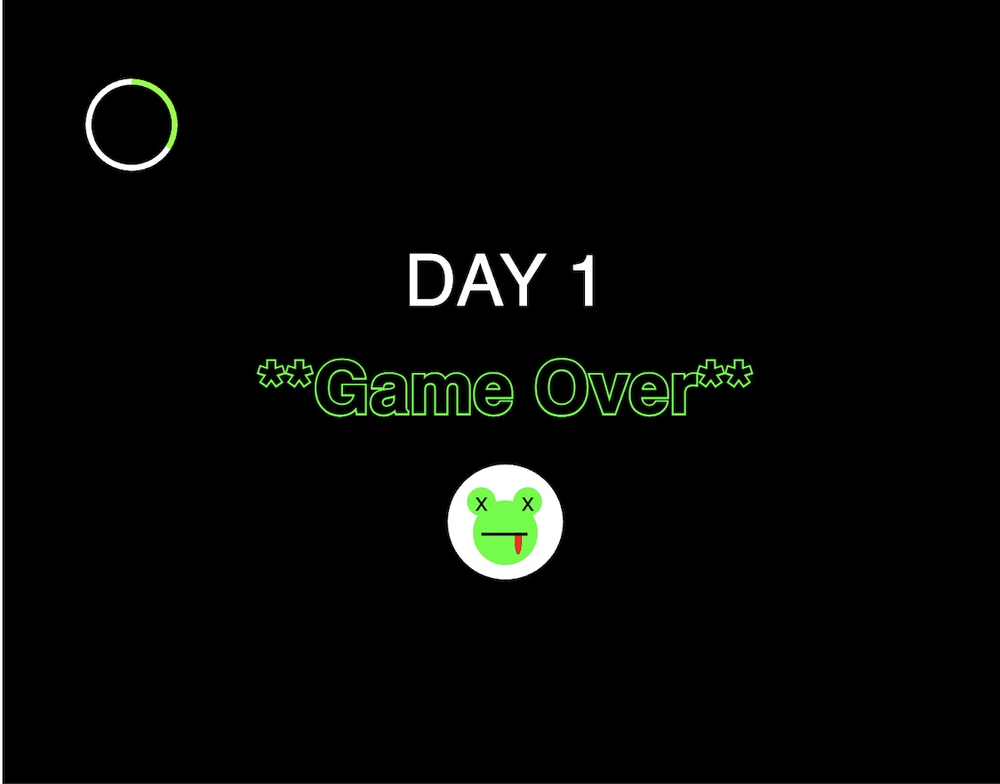

# Mod-Jam: Life as a Frog

Yaxuan Pang

[View this project online](https://yaxuanpang.github.io/cart253/topics/mod-jam/)

## Description

This description should help the reader understand what the program is, anything they should know to be able to experience it (controls, special features, etc.), and what the desired user experience is. For example:

> Move the frog some side to side with the mouse and click space to launch the tongue

> The frog changes colors when it gets hurt (by birds or starvation). It starts to die if it does not eat for 3 seconds

>  

> The experience is controlled via the mouse, with left click selecting a clown and bringing up a menu of options such as "slip of banana peel" or "get into impossible capacious clown-car."

> The project is meant to give the user a sense of what it would be the mayor of a town of clowns, eventually getting the sense that clowns are not taking their civic duties seriously.

## Screenshot(s)

> 

## Attribution

This bit should attribute any code, assets or other elements used taken from other sources. For example:

> - This project uses [p5.js](https://p5js.org).
> - The clown image is a capture of the clown from the Apple emoji character set.
> - The barking sound effect is "single dog bark 1" by crazymonke9 from freesound.org: https://freesound.org/people/crazymonke9/sounds/418107/

## License

This bit should include the license you want to apply to your work. For example:

> This project is licensed under a Creative Commons Attribution ([CC BY 4.0](https://creativecommons.org/licenses/by/4.0/deed.en)) license with the exception of libraries and other components with their own licenses.