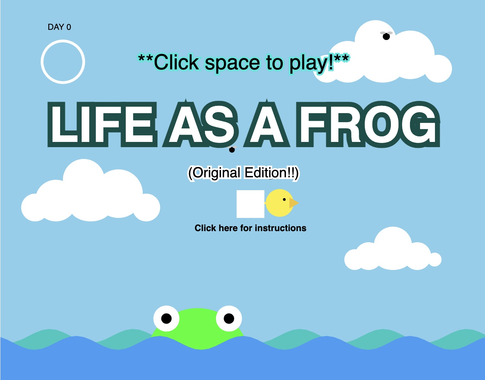
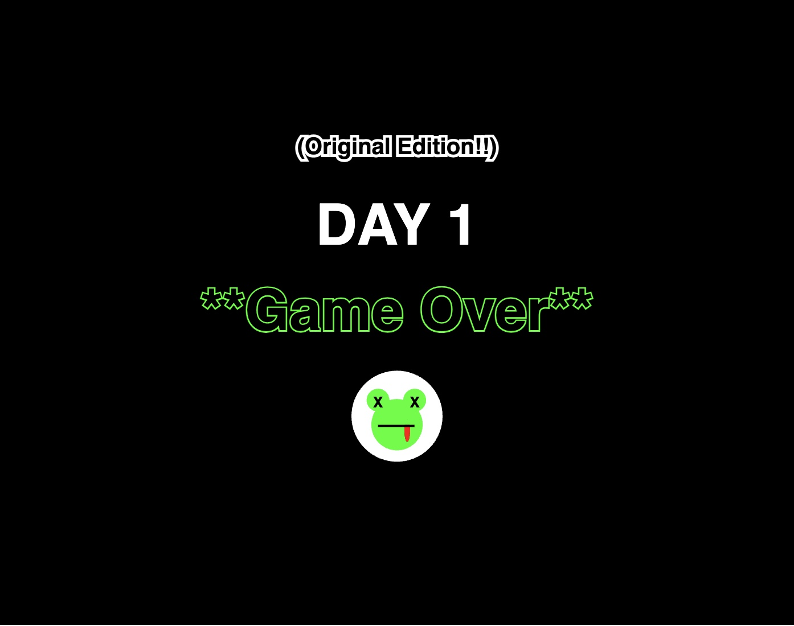

# Variation-Jam: Life as a Frog (Original Edition!)

Yaxuan Pang

[View this project online](https://yaxuanpang.github.io/cart253/topics/variation-jam-original/)

[View spring variations](https://yaxuanpang.github.io/cart253/topics/variation-jam-spring/)

[View summer variations](https://yaxuanpang.github.io/cart253/topics/variation-jam-summer/)

[View fall variations](https://yaxuanpang.github.io/cart253/topics/variation-jam-autumn/)

[View winter variations](https://yaxuanpang.github.io/cart253/topics/variation-jam-winter/)

## Description

Life of a Frog is a game about catching flies with the frog's tongue. It portrays a semi-realistic life of a frog.The frog (player) needs to eat flies to avoid starving to death and avoid predators. Last 3 full days or eat the special fly to win the game!

There are 5 different game mode, original, spring, summer fall and winter. Each mode will give a different experience and add different challenges to the game.

> Move the frog some side to side with the mouse and click space to launch the tongue.

> The frog changes colors when it gets hurt (by birds or starvation). It starts to die if it does not eat for 3 seconds. 5 seconds after eating the bird, the frog will start healing.

>  There is a night and day cycle with a ring in the top left corner that tracks the number of days the frog survives. It makes a full rotation after one full day and updates the number of days the frog has lived. 

> At night, a flashlight will appear. If the flashlight overlaps with the frog, it dies.

## Modifications

> Menu screen with instructions and moving elements

> Added special fly that can teleport

> Added another way to win the game (the special fly while the frog is healthy)

## Screenshot(s)

> 
> 
> 
> 
> 

## Attribution

> - This project uses [p5.js](https://p5js.org).
> - This projects uses the code from the variables challenge (https://concordia.yuja.com/V/Video?v=1071104&node=5700521&a=117175823)
> - This projects uses the code from the conditionals challenge (https://yaxuanpang.github.io/cart253/topics/conditionals-challenge/).

## License

> This project is licensed under a Creative Commons Attribution ([CC BY 4.0](https://creativecommons.org/licenses/by/4.0/deed.en)) license with the exception of libraries and other components with their own licenses.