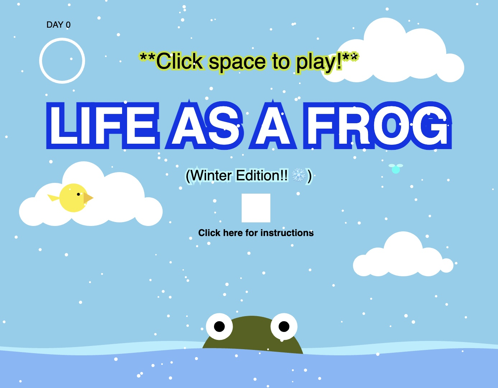
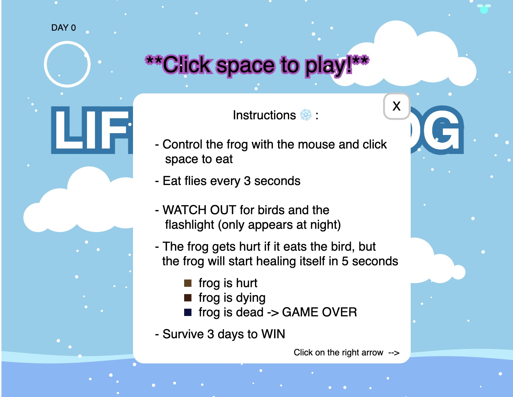
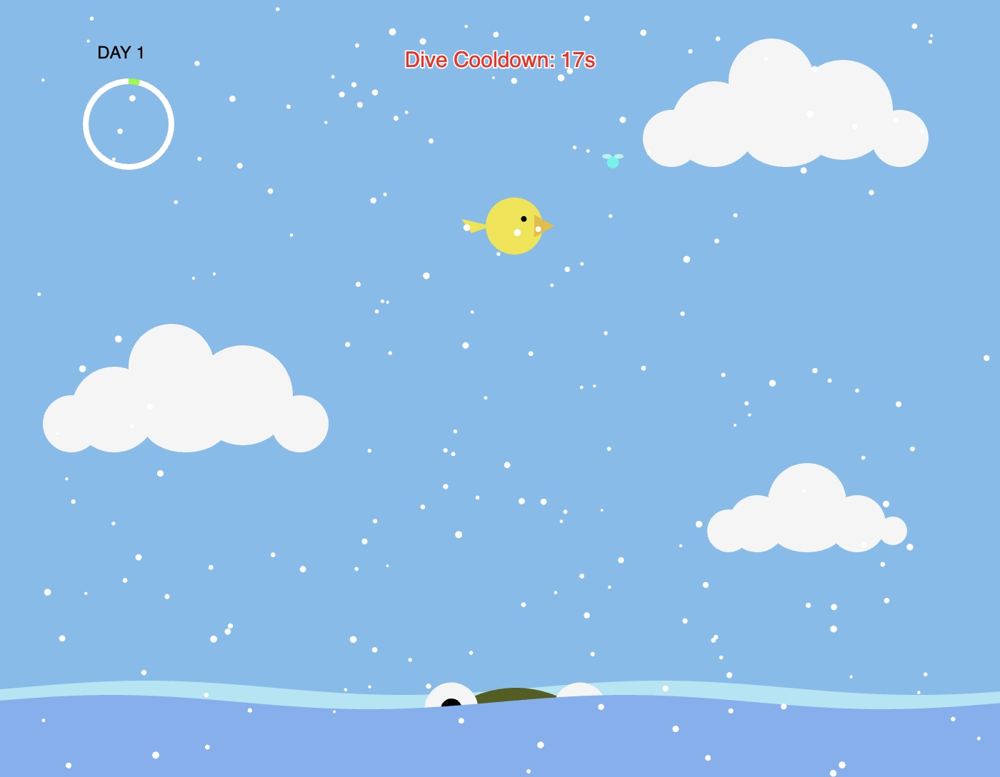
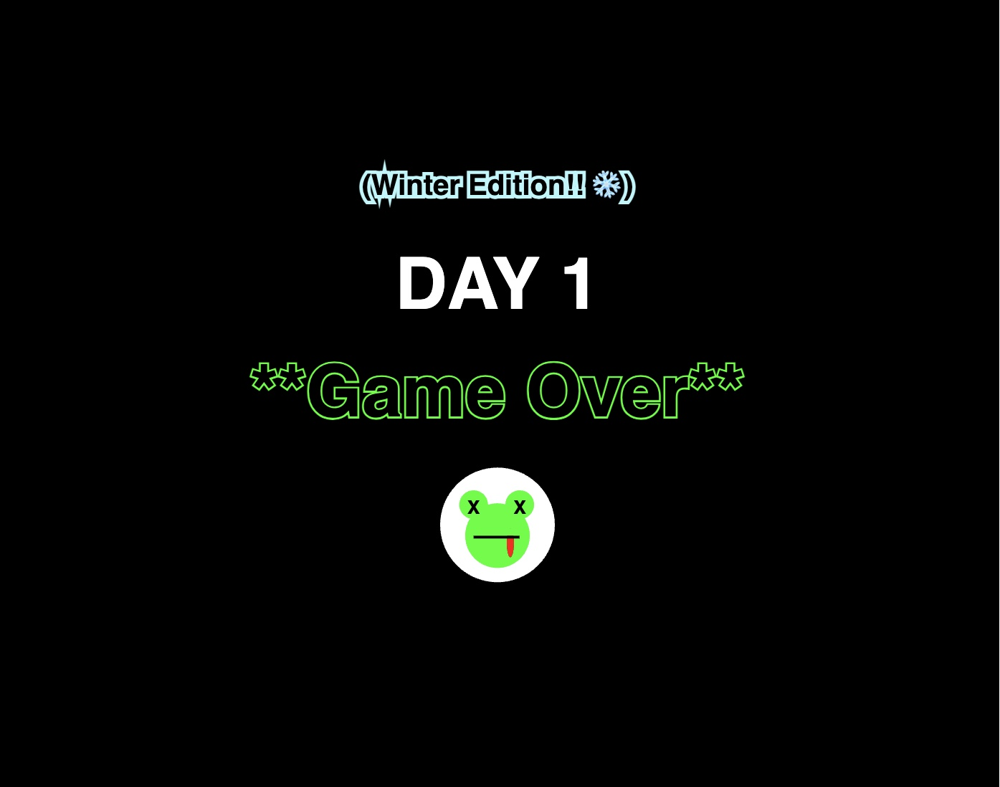

# Variation Jam : Life as a Frog (Winter Edition)

Yaxuan Pang

[View this project online](https://yaxuanpang.github.io/cart253/topics/variation-jam-winter/)

[View original variation](https://yaxuanpang.github.io/cart253/topics/variation-jam-original/)

[View spring variation](https://yaxuanpang.github.io/cart253/topics/variation-jam-spring/)

[View summer variation](https://yaxuanpang.github.io/cart253/topics/variation-jam-summer/)

[View fall variation](https://yaxuanpang.github.io/cart253/topics/variation-jam-autumn/)

## Description

Life of a Frog is a game about catching flies with the frog's tongue. It portrays a semi-realistic life of a frog.The frog (player) needs to eat flies to avoid starving to death and avoid predators. Last 3 full days to win the game!

There are 5 different game mode, original, spring, summer fall and winter. Each mode will give a different experience and add different challenges to the game.

This is the winter variation! Keep diving underwater to stay warm and to not freeze to death. Eat flies, avoid bird and avoid the flashlight.

> Move the frog some side to side with the mouse and click space to launch the tongue.

> The frog changes colors when it gets hurt (by birds or starvation). It starts to die if it does not eat for 3 seconds. After 5 seconds of eating the bird, the frog will start healing.

>  There is a night and day cycle with a ring in the top left corner that tracks the number of days the frog survives. It makes a full rotation after one full day and updates the number of days the frog has lived. 

> At night, a flashlight will appear. If the flashlight overlaps with the frog, it dies.

> There is a cooldown of 10 seconds before the frog can dive underwater again

## Modifications

> Changed the colors to a winter color palette

> Added a title screen with instructions (2 pages)

> Changed the wave shape

> Removed all birds except for one

> Kept 2 flies and changed their color to bright blue

> Added a new movement for the frog

> Cooldown period

> Added snow

## Screenshot(s)

> 
> 
> 
> 
> 

## Attribution

> - This project uses [p5.js](https://p5js.org).
> - This projects uses the code from the variables challenge (https://concordia.yuja.com/V/Video?v=1071104&node=5700521&a=117175823)
> - This projects uses the code from the conditionals challenge (https://yaxuanpang.github.io/cart253/topics/conditionals-challenge/)
> - This projects uses the code from (https://editor.p5js.org/TheCurlyPasta/sketches/HkbMtLNJV) for the snowflakes.

## License

> This project is licensed under a Creative Commons Attribution ([CC BY 4.0](https://creativecommons.org/licenses/by/4.0/deed.en)) license with the exception of libraries and other components with their own licenses.